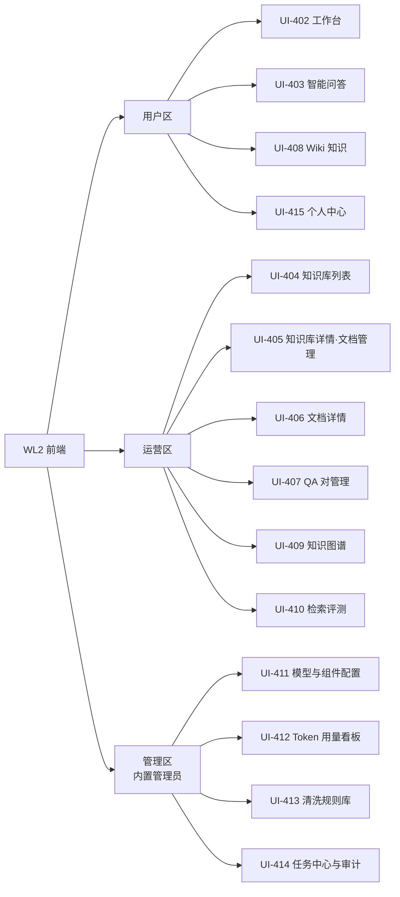

# WisdomLink2 企业级智能知识库平台 · 前端系统设计文档

| 文档头 | |
|---|---|
| 项目代号 / 名称 | wl2 / WisdomLink2 企业级智能知识库平台 |
| 文档名称 | 前端系统设计文档（信息架构 · 页面详细设计 · 视觉与组件规范） |
| 文档 ID | WL2-DOC-004 |
| 版本 | v1.1（语义化版本；确定性版本号 1.26.911.2400） |
| 日期 | 2026-09-17 |
| 作者 | HUAWEI（取自当前用户标识） |
| 状态 | **草稿**（待确认门；上游 WL2-DOC-001 v1.2 / WL2-DOC-002 v1.2 均为草稿，引用标注"来源未基线"） |
| 生成方式 | 正向生成（来源：用户第二轮修订意见第 2 条 + WL2-DOC-001 v1.2 + WL2-DOC-002 v1.2） |

## 修订记录

| 版本 | 日期 | 作者 | 变更说明 |
|---|---|---|---|
| v1.0 | 2026-09-11 | HUAWEI | 初稿：信息架构、15 个页面逐页详细设计（功能+视觉）、设计 token、组件规范、交互状态、可用性与美观度验收标准 |
| v1.1 | 2026-09-17 | HUAWEI | 对齐实现：§5.5 UI-408 Wiki 页按实际实现重写（文件夹分组页面树、三重操作入口、页面生命周期、宽屏内联+窄屏 Drawer 响应式），标注未实现项（拖拽排序/版本 diff/评论/编辑锁）；§8.2 新增字号使用规则与图标尺寸规范 |

## 目录

- 第 0 章 引言
- 1 设计概述与视觉基调
- 2 信息架构与导航
- 3 页面清单（UI-ID 总览）
- 4 关键页面详细设计与线框（UI-402/403/405/412）
- 5 其余页面详细设计（UI-401/404/406/407/408/409/410/411/413/414/415）
- 6 全局交互状态与流程规范
- 7 组件规范
- 8 设计 Token（色板/字号/间距/圆角/动效）
- 9 原型说明
- 10 可用性目标与美观度验收标准
- 11 评审记录（草案自评）
- 附录 A UI ↔ 需求/设计 映射
- 附录 B 待确认清单

---

# 第 0 章 引言

## 0.1 一页摘要（业务语言）

本文档定义 WisdomLink2 前端的**全部页面长什么样、每个页面干什么、以及"美观"到什么可验收的程度**。共 **15 个页面**，覆盖普通用户主线（工作台 → 提问 → 看引用下钻原文）与运营主线（知识库/文件夹管理 → 文档入库与清洗 → QA 维护 → 图谱 → 评测 → Token 看板）。

视觉基调一句话：**专业、克制、可信的企业知识工作台**——蓝色主色只用在关键动作与状态上（面积占比 ≤10%），大量留白 + 三级文字层级 + 统一 4px 间距网格，信息密度中高但不拥挤；每个数据区域都有加载/空/错误三态，每次等待都有骨架屏或流式反馈，杜绝"白屏"与"布局跳动"。**美观不是主观感受，而是可验收的清单**（§10：8 条可判定走查项 + L0–L3 分级，上线门槛整体 ≥L2、问答页/知识库详情页力争 L3）。

## 0.2 目的与范围

覆盖 V1 全部前端页面与全局交互/视觉规范。**不含**：V2 页面（登录后用户管理/权限分配/API Key——预留导航分组位）、组件代码级实现（C-02/C-03）、接口字段契约（B-04）。

## 0.3 读者与阅读指南

| 角色 | 关注点 | 建议阅读 |
|---|---|---|
| 业务/产品 | 页面功能全景与体验承诺 | §0.1、§2、§3、§10 |
| 前端开发 | 每页区块/交互/token/组件 | §4、§5、§7、§8 |
| UI 设计 | 视觉规范与验收口径 | §1、§8、§10 |
| 测试 | 状态矩阵与走查清单（可判定） | §6、§10、附录 A |
| 决策人 | 待确认项（品牌色等） | 附录 B |

## 0.4 术语表（前端专用；业务术语见 WL2-DOC-001 v1.2 §0.5）

| 术语 | 解释 |
|---|---|
| 设计 Token | 设计决策的最小变量（色值/字号/间距/圆角），全局统一引用，改一处全局生效 |
| 骨架屏 | 加载期间的灰色占位块，体感优于转圈 |
| 流式输出（打字机） | 回答逐字出现的呈现方式，配闪烁光标与"停止"按钮 |
| 引用角标 | 回答文本中的上标 [1]，hover 浮出出处预览卡，点击打开溯源抽屉 |
| 溯源抽屉 | 右侧滑出的四级下钻面板（引用→片段→版本→原件） |
| 三态完备 | 每个数据区域具备 加载/空/错误 三种状态设计 |
| 状态徽章 | 文档/QA/任务的彩色状态标签（解析中/清洗中/已发布/失败…），色彩语义全局统一 |
| L0–L3 | 美观度分级：不可用 / 可用但粗糙 / 整洁一致 / 精致愉悦（§10 定义） |
| 主色面积占比 | 主色像素占首屏比例，克制度指标（≤10%） |

## 0.5 参考资料

WL2-DOC-001 v1.2（需求）、WL2-DOC-002 v1.2（模块 SD-ID 与接口职责）、Element Plus 组件库规范（ADR-008，B-9）。

---

# 1 设计概述与视觉基调

## 1.1 设计原则（每页自查）

1. **页面为任务服务**：每个页面回答"用户在这里完成什么任务"（B-03 准则，§3 清单逐页标注）。
2. **克制的色彩**：主色 `#2563EB`（智慧蓝，可配置品牌 token）仅用于主按钮、选中态、链接、关键状态；语义色只表状态不做装饰。
3. **三级文字层级**：标题（gray-900 / 16-20px / 600）、正文（gray-700 / 14px / 400）、辅助（gray-500 / 12-13px / 400）；同层级全局一致。
4. **4px 间距网格**：所有间距为 4 的倍数；卡片内边距 16/24；页面四周留白 24。
5. **等待必有反馈**：骨架屏（列表）/ 进度条（任务）/ 流式打字（生成），任何超过 300ms 的操作都有可见反馈。
6. **真实感优先**：状态徽章反映真实状态机（BR-008）；降级模式显式黄条告知；拒答卡片明确说"没找到"。
7. **可验收的美观**：§10 走查清单逐项可判定，不接受"我觉得好看"。

## 1.2 视觉基调关键词

`专业` `克制` `可信` `高效` —— 企业知识工作台气质：白底浅灰背景、卡片化分区、微圆角（8px）、轻阴影（hover 抬升）、线性图标（1.5px 描边）、无大面积渐变与插画堆砌（空状态除外）。

---

# 2 信息架构与导航

## 2.1 站点地图



图 2-1 站点地图（15 页面 + 导航分区；来源：FR 全集 → §3 页面清单）

## 2.2 全局布局与导航

```
┌────────┬──────────────────────────────────────────┐
│        │  顶部栏 56px：面包屑 │ 全局搜索⌘K │ 组件状态● │
│ 左侧导航 ├──────────────────────────────────────────┤
│ 240px  │                                          │
│ (可折叠 │           内容区（滚动）                  │
│  64px) │           页面边距 24px                   │
│        │                                          │
└────────┴──────────────────────────────────────────┘
```

- 左侧导航四分组：**使用**（工作台/智能问答/Wiki）｜**知识运营**（知识库/QA 管理/知识图谱/检索评测）｜**系统管理**（模型与组件/Token 看板/清洗规则/任务与审计）｜折叠按钮+底部内置管理员标识（头像+"管理员"徽章，V2 换为用户身份）。
- 顶部栏：面包屑（≥二级）、全局搜索（⌘K/`/` 唤起，搜文档/QA/Wiki 页）、**组件状态灯**（绿=全部健康/黄=降级模式 hover 列出受影响能力，来源 NFR-241/222）。
- 普通用户默认落在 UI-403 问答页；管理员首次进入引导配置（空状态指引）。
- 键盘：`/` 聚焦提问框；`Esc` 关抽屉/搜索；`⌘K` 全局搜索（NFR-252 浏览器）。

---

# 3 页面清单（UI-ID 总览）

| UI-ID | 页面 | 用户任务（一句话） | 来源 FR / SD | 优先级 |
|---|---|---|---|---|
| UI-401 | 守门/登录页 | 管理员进入管理面（或全员口令开关） | FR-111 / SD-313、NFR-219 | Must |
| UI-402 | 工作台首页 | 一眼看状态、快速提问、直达最近会话 | FR-107/114/145 | Must |
| UI-403 | 智能问答页（核心） | 提问→获得 QA 秒回或 RAG 带引用回答→下钻验证 | FR-107/114/118/127/131/146 / SD-307/307a/318/316 | Must ★ |
| UI-404 | 知识库列表页 | 找到/创建目标知识库 | FR-102 / SD-303 | Must |
| UI-405 | 知识库详情·文档管理（核心） | 文件夹分类 + 批量上传 + 状态跟踪 | FR-102/103/104/113/126 / SD-303/304 | Must ★ |
| UI-406 | 文档详情页 | 查元数据/版本/清洗对照/原件预览 | FR-104/115/118/126 / SD-315/316 | Must |
| UI-407 | QA 对管理页 | 维护 QA 对、看命中、沉淀高频问题 | FR-131 / SD-318 | Must |
| UI-408 | Wiki 知识页 | 写/读结构化知识并自动入索引 | FR-120 / SD-308 | Should |
| UI-409 | 知识图谱页 | 维护概念/实体/关系与校对抽取 | FR-121/117/140 / SD-309 | Should |
| UI-410 | 检索评测工作台 | 建评测集、跑评测、A/B 对比 | FR-124 / SD-306 | Should |
| UI-411 | 模型与组件配置页 | 本地/远程切换、向量库管理、模型矩阵 | FR-109/110/123 / SD-310/311 | Must |
| UI-412 | Token 用量看板 | 看消耗与费用、定位异常 | FR-132/128 / SD-310/313 | Must |
| UI-413 | 清洗规则库页 | 维护清洗规则、看清洗质量 | FR-115/116 / SD-315 | Should |
| UI-414 | 任务中心与审计页 | 处置失败任务/死信、查审计 | FR-112/113 / SD-312/313 | Must |
| UI-415 | 个人中心 | 管理自己的会话/导出/反馈 | FR-114/144 | Could |

---

# 4 关键页面详细设计与线框

> 每页五段：任务与入口 / 布局与线框 / 功能明细（区块→交互→来源）/ 状态设计 / 视觉与美观要点。

## 4.1 UI-403 智能问答页（核心，目标 L3）

**任务与入口**：普通用户主线页面——提问、多轮追问、验证答案真实性（SC-001/004/012/014）。左侧导航"智能问答"，默认首页。

**布局与线框**（三栏：会话列表 264px ｜ 对话区自适应 ｜ 来源面板 320px（可收起））：

```
┌──────────┬───────────────────────────────┬──────────────┐
│ + 新对话  │  检索范围: [产品库▾][+库][▾夹] │ 来源面板      │
│──────────│───────────────────────────────│ （本回答引用） │
│ ▸ 今天    │                               │              │
│  年假…    │   [用户] WiFi 密码多少？        │ ① 制度手册 v3 │
│  报销…    │   [QA答案卡·绿左边框"标准答案"]  │   p12 · 0.95 │
│ ▸ 昨天    │   密码为××××，维护于09-01      │ ② IT手册 v2  │
│ ▸ 更早    │   [查看AI深度回答] [有用👍]     │   p3 · 0.88  │
│──────────│                               │ ──────────── │
│ 搜索会话  │   [用户] 报销流程？             │ 相关实体      │
│          │   [AI·流式] 报销分三步…[1][2]   │  #报销 #OA   │
│          │   ▸ 引用 2 · token 1.2k · 1.8s │  #财务审批    │
│          │   [复制][重新生成][导出本对话]   │              │
│──────────│───────────────────────────────│──────────────│
│          │ ┌─────────────────────────────┐│              │
│          │ │ 提问框（/聚焦）        [发送] ││              │
│          │ └─────────────────────────────┘│              │
└──────────┴───────────────────────────────┴──────────────┘
```

**功能明细**：

| 区块 | 功能与交互 | 来源 |
|---|---|---|
| 会话列表 | 按今天/昨天/更早分组；重命名/删除/导出（含引用）；搜索；hover 显示操作 | FR-114 |
| 检索范围选择器 | 多选知识库；展开库可选文件夹（默认全部）；范围存入会话（scope）；切换后下一问生效 | FR-102、BR-011 范围 |
| 消息流-QA 卡 | 命中时绿色左边框卡片：徽标"标准答案（QA）"+所属库+维护时间（>90 天未复审显示"待复核"黄标）；按钮：查看 AI 深度回答（次级）、反馈 | FR-131、BR-011、R12 |
| 消息流-RAG 回答 | 流式打字（光标闪烁、可"停止"）；正文引用上标 [n]：hover 浮出出处预览卡（文档名/页码/相似度），点击打开溯源抽屉；底部元信息行：引用数 · token 消耗 · 耗时 · 模型名 · 缓存/QA 标记 | FR-107/118/127/132 |
| 拒答卡 | 灰底信息卡"未在知识库中找到依据"+推荐相邻知识库入口；绝不显示无引用断言 | BR-004 |
| 冲突提示 | 双引用并列 + "存在不一致，以最新生效文档为准"横条，两处引用可分别下钻 | BR-004 边界 |
| 来源面板 | 当前回答引用列表（编号/文档/版本/页码/得分），点击滚动定位并开溯源抽屉；"相关实体"标签组（图谱推荐，点击即以该实体提问） | FR-118/117 |
| 溯源抽屉（全局组件） | 四级 Tab 步进：① 片段（清洗前后对照 diff，红删绿增）→ ② 版本与位置（页码/标题路径/生效日期）→ ③ 原件预览（PDF.js 高亮定位；Office 显示转换缓存页）→ ④ 下载原件；哈希校验失败顶部红条"内容可能已变更"；旧版黄标"非最新版+最新版入口" | FR-118、BR-009/010、SD-316 |
| 提问框 | 多行自适应；`/` 聚焦；Enter 发送/Shift+Enter 换行；发送后立即出现"思考中…"气泡（意图分析阶段文案），QA 命中 ≤200ms 直接替换（NFR-207 体感"秒回"） | FR-107/131 |

**状态设计**：加载=会话列表骨架屏 + 回答流式；空=引导卡（三示例问题可点击）；错误=重试气泡（保留已输入内容）；降级=顶部黄条"语义检索不可用，已切换关键词模式"（NFR-222）；双 LLM 故障=展示纯检索结果列表卡"AI 回答暂不可用，以下为相关片段"。

**视觉与美观要点**：QA 卡与 RAG 回答形态区分明确（左边框色：QA=绿 success、RAG=蓝 primary、拒答=灰）；引用角标统一 12px 蓝色上标，hover 浮卡带 0.2s 淡入；打字光标 500ms 闪烁；来源面板卡片式、得分用 60px 迷你进度条可视化；会话分组标题 12px 灰色大写风格。整页仅"发送"按钮用主色实心。

## 4.2 UI-405 知识库详情·文档管理页（核心，目标 L3）

**任务与入口**：管理员运营知识库（SC-002/010/013）——组织文件夹、批量上传、跟踪解析/清洗/索引状态。

**布局与线框**（左：文件夹树 260px；右：文档列表；上传向导为抽屉）：

```
┌────────────┬──────────────────────────────────────────┐
│ 库名·设置⚙  │ 工具条: [↑上传][批量操作▾][搜索][筛选▾][刷新]│
│ ＋新建文件夹│ 面包屑: 产品库 / 制度 / 财务                │
│────────────│──────────────────────────────────────────│
│ ▾ 📁 制度   │ ☑ 标题        状态      版本  生效日  操作 │
│   📁 财务●  │ ☑ 报销制度.pdf [已发布]v3.0 09-01 [···]  │
│   📁 考勤   │ ☐ 入职指南.docx[清洗中⟳] v1.0   —   [···]  │
│ ▸ 📁 手册   │ ☐ 流程图.png  [解析失败⚠] —     —   [重试] │
│ ▸ 📁 案例   │ ☐ …（分页 20/页）                        │
│ 拖拽移动文档→│                                          │
└────────────┴──────────────────────────────────────────┘
上传抽屉: ①选文件夹 → ②拖拽区(虚线160px) → ③解析预览(前3页) → ④清洗预览(diff) → ⑤提交
```

**功能明细**：

| 区块 | 功能与交互 | 来源 |
|---|---|---|
| 文件夹树 | 多级展开（≤5 级）；右键/⭐菜单：新建/重命名/删除（有文档需确认并可选移动）；文档行拖拽到文件夹即移动；当前文件夹高亮主色浅底 | FR-102 |
| 文档列表 | 列：勾选/标题/状态徽章/版本/生效日期/操作；行高 48；hover 浅灰+操作浮现；按状态/标签/时间筛选；标题点击进 UI-406 | FR-104 |
| 状态徽章实时性 | 解析中/清洗中/索引中为动画徽章（转圈），完成后行内 toast+列表刷新；失败徽章红色，行内"重试"按钮 | FR-113、BR-008 |
| 批量操作 | 移动到文件夹/打标签/下线/删除（回收站 30 天提示）；批量进度浮层 | FR-104/102 |
| 上传向导（5 步抽屉） | ① 目标文件夹 → ② 拖拽/多选（单文件 ≤100MB，B-8）→ ③ 解析预览（前 3 页结构）→ ④ **清洗预览**（diff 视图，可调规则重试）→ ⑤ 提交（异步任务受理，toast"已受理，可在任务中心跟踪"）；重复文件（SHA-256）行内提示"已存在，可新建版本" | FR-103/115/126、BR-002 |
| 库设置 | 策略三件套（清洗/分片/检索参数模板）+ QA 阈值 + is_local_only 开关（开启后强制本地模型，黄条警示） | FR-102/109、NFR-217 |

**状态设计**：空库=树只有根+引导卡"上传第一批文档"；加载=表格骨架；上传失败=向导内红条+原因+重试；删除确认=红色确认模态（输入库名确认删库）。

**视觉与美观要点**：状态徽章色系全局统一（见 §7.4）；树与列表联动（点树过滤列表，面包屑同步）；diff 预览红删绿增、等宽字体；拖拽移动时目标文件夹高亮虚线框；数字列右对齐、日期统一 `YYYY-MM-DD`。

## 4.3 UI-412 Token 用量看板页

**任务与入口**：管理员掌握模型消耗与费用（SC-015）。管理区导航。

**布局与线框**（上：4 指标卡；中：趋势图；下：两列排行+明细表）：

```
┌────────────────────────────────────────────────────┐
│ 今日消耗 1.2M tok │ 本月费用 ¥186.50 │ 节省(QA+缓存) │ 日耗告警 ⚙上限 │
├────────────────────────────────────────────────────┤
│ [按日/按月] 趋势: 输入tok/输出tok/费用 三线图 (ECharts)│
│ 维度切换: [模型▾][知识库▾][用途▾] 时间: [近7天/30天/自定义]│
├──────────────────────┬─────────────────────────────┤
│ Top 模型排行(横向条)  │ Top 知识库排行(横向条)        │
├──────────────────────┴─────────────────────────────┤
│ 明细表: 日期|模型|库|用途|输入|输出|调用|错误|费用|估算?  │
│ [导出CSV]  行点击→下钻该组合的会话明细（新抽屉）          │
└────────────────────────────────────────────────────┘
```

**功能明细**：

| 区块 | 功能与交互 | 来源 |
|---|---|---|
| 指标卡 | 今日 token、本月费用（无单价配置时显示"未配置单价，仅计量"）、节省量（QA 命中+缓存命中折算）、日耗上限与当前告警状态；数字用 24px 大数字+环比小箭头 | FR-132、BR-012 |
| 趋势图 | 双轴：token 柱状+费用折线；维度切换（模型/库/用途）与时间范围联动；悬停 tooltip 显示明细 | FR-132 |
| 排行 | Top5 横向条形图（主色渐进，非彩虹色）；点击条=下钻该维度 | FR-132 |
| 明细表 | 聚合行（日×模型×库×用途）；"估算"列徽标区分 usage/估算（BR-012 反例口径）；导出 CSV（审计记录导出行为） | FR-132/112 |
| 告警设置 | 日耗上限（token 或费用）配置；触达方式（站内标记/延后 IM Webhook-FR-143） | FR-132/128 |

**状态设计**：空=无调用时引导卡"发起第一次问答后 24h 内出数"；加载=图表骨架；估算数据=表头黄点提示"部分本地调用为估算值"。

**视觉与美观要点**：四指标卡白卡+轻阴影，数字 24px/600；图表配色=主色+主色 60%/30% 透明度渐变（不用多色系）；费用统一 ¥ 两位小数；排行条等高 24px 圆角。

## 4.4 UI-402 工作台首页

**任务**：普通用户"进来 3 秒可提问"；管理员"一眼看系统健康"。

**功能明细**：① 顶部大搜索框（居中 640px，输入即跳转问答页并发送——零打断）；② 快捷入口四卡（智能问答/知识库/Wiki/图谱）；③ 最近会话列表（≤5 条，点击续聊）；④ 热门问题 Top10（FR-145，含 QA 命中榜标记，点击即问）；⑤ 系统状态条（管理员可见：组件状态灯+今日 token+任务积压）。
**状态**：新用户空态=引导卡三步（建库→传文档→提问）配线性插画。
**视觉**：首屏无表格、大留白；搜索框为视觉焦点（主色边框 focus 光晕）；四卡 hover 上浮 2px。

---

# 5 其余页面详细设计

## 5.1 UI-401 守门/登录页

- **任务**：内置管理员登录管理面（或全员口令开关开启时的入口门）。
- **功能**：账号+密码（初始密码环境变量引导首登改密）；登录失败 5 次锁定 15 分钟提示；"仅管理员需登录，问答入口免登录"说明文案（B-22 默认态）；全员口令模式=单输入框。
- **状态**：错误=红条+抖动动画；锁定=倒计时。
- **视觉**：居中 360px 卡片，左侧品牌区（Logo+产品名+一句话），浅灰背景 #F5F7FA，主色仅登录按钮。

## 5.2 UI-404 知识库列表页

- **任务**：找到/创建目标知识库（FR-102）。
- **功能**：卡片网格（3 列响应式）：库名/描述/文档数/QA 数/状态（使用中·已归档）；创建库向导（名称→策略模板三件套→清洗模板→可选"仅本地"开关）；卡片操作：进入/归档/删除（输入库名确认）；搜索与排序。
- **状态**：空=插画引导"创建第一个知识库"；归档库灰显置底。
- **视觉**：卡片 8px 圆角，图标 per 库可选（12 个预设线性图标）；数字徽章 13px。

## 5.3 UI-406 文档详情页

- **任务**：核查单个文档全生命周期（SC-010/012/013）。
- **功能**（页内 Tab）：
  - 概览：元数据（文件夹/标签/生效日期/来源/SHA-256 前 8 位）、状态时间线（BR-008 各阶段+耗时）、版本切换（v1.0/v2.0…）；
  - 原文预览：PDF.js 流式加载、页码定位（引用跳转入口）；
  - 清洗对照：左右分栏 diff（原文 vs 清洗后），规则命中列表（每条可跳转原文位置），"误伤标记"按钮（入 R10 队列）、"按原文重建"（BR-009）；
  - 分片视图：chunk 列表（编号/token 数/页码/父子关系树），单 chunk 哈希状态（校验通过✓/警示⚠）；
  - 版本历史：版本列表+diff 摘要+回滚。
- **来源**：FR-104/115/118/126、BR-009/010。
- **视觉**：Tab 下划线式；diff 红删绿增等宽字体；时间线垂直左侧轴线。

## 5.4 UI-407 QA 对管理页

- **任务**：维护 QA 对与命中质量（SC-014）。
- **功能**：
  - 列表：问题/所属库/文件夹/状态（启用/停用/草稿/**待复核**）/命中次数/最近命中/维护时间；筛选与搜索；
  - 编辑抽屉：标准问、标准答（Markdown 编辑器+实时预览）、相似问变体列表（可增删，实时提示归一化后是否与已有重复）、引用文档关联（可搜选择，命中时展示可下钻）、启停与权重；
  - 批量导入/导出：Excel/CSV 模板下载、导入校验报告（重复/超长/无效行号）；
  - **沉淀入口**：右侧"待沉淀"面板——问答日志高频/未命中问题榜（FR-145 数据），一键转 QA 草稿（预填问题+最佳历史回答）；
  - 复审队列：>90 天未复审列表（R12/B-31）。
- **来源**：FR-131、BR-011、SD-318。
- **视觉**："待复核"黄徽章、"启用"绿徽章；命中次数列迷你条形图；变体列表 chips 样式。

## 5.5 UI-408 Wiki 知识页

- **任务**：读写结构化知识并自动入检索（SC-003）。
- **实现形态（v1.1 对齐代码）**：
  - 页头：发布目标知识库选择 + 新建文件夹 + 新建页面；
  - 左页面树：**复用知识库文件夹结构分组**（文件夹节点+页面叶子，空文件夹也展示），页面正文点击后懒加载（不批量拉取）；
  - 内容区（宽屏 ≥900px）：左树右内联内容（A 为主）——阅读态（Markdown 渲染，正文 16px/行高 1.75/最大 820px）与编辑态（标题+MD 文本域+取消/发布并入库）原地切换，保持阅读流与编辑连贯性；
  - 窄屏（<900px，B 补充）：单栏布局，点树节点用 Drawer（88% 宽）弹出展示/编辑；
  - 页面操作入口（三重可发现性）：①内容区操作栏（编辑页面/上下线/删除）；②树节点悬停快捷图标（页面：编辑/更多；文件夹：新建子文件夹/在此新建页面/删除）；③右键上下文菜单（编辑/上线/下线/删除/新建子文件夹/在此新建页面/删除文件夹）；
  - 页面生命周期：编辑发布走该文档**原地新版本**（旧版分片/向量级联清理），标题随文件名同步；下线即时退出检索（可恢复）；删除进回收站 30 天；
  - 文件夹管理：树内新建（根级或子级，≤5 级）、删除（其下页面回落上级/根目录，不丢内容）；从文件夹入口新建页面自动归入该文件夹并显示归属提示；
  - 状态标识：已入检索索引（绿）/已下线（橙）徽章；树节点离线小圆点；内置示例页不参与检索并有提示。
- **规划中未实现（延后）**：拖拽排序、版本对比 diff+回滚、评论区、他人编辑锁定、图片粘贴上传。
- **来源**：FR-120、SD-308。
- **视觉**：阅读态类文档站排版（正文 16px/行高 1.75/最大 820px）；树节点与导航文本 14px，次级说明 12-13px（见 §8.2 使用规则）。

## 5.6 UI-409 知识图谱页

- **任务**：维护概念/实体/关系与校对抽取（SC-007）。
- **功能**（三主 Tab + 校对队列）：
  - 概念：is-a 树管理（增删改、同义词 chips）、与实体挂接统计；
  - 实体：表格（名称/概念类型/别名数/状态[候选|已确认]/证据数）+ 编辑抽屉（别名管理、合并/拆分、挂接概念）；
  - 关系：表格（源→关系→目标/证据链/状态）+ 编辑；
  - 校对队列：抽取任务产出的候选三元组列表（置信度、来源 chunk 预览、✓确认/✗拒绝/✏修改），批量确认；
  - 导入导出：CSV/JSON 三元组（往返一致性，FR-121 验收）；
  - 可视化浏览（FR-140，Could）：力导向图（节点=概念色环+实体），点击展开一跳。
- **来源**：FR-121/117/140、SD-309。
- **视觉**：候选/确认双色徽章；关系表格中"源→关系→目标"用 chips+箭头呈现；可视化图节点 ≤200 加"展开更多"。

## 5.7 UI-410 检索评测工作台

- **任务**：客观度量检索与 QA 命中质量（FR-124）。
- **功能**：评测集管理（问题/标准出处/标签，批量导入）；一键评测（进度+结果：Recall@5/10、MRR@10；**QA 部分：命中率/误命中率**）；A/B 对比（选两份配置快照跑同集，差异表+提升/回退高亮）；历史记录。
- **来源**：FR-124、§8.8、SD-306。
- **视觉**：指标大数字卡+趋势小图；A/B 差异列绿升红降；报告可导出（发布门禁证据，宪法红线 2）。

## 5.8 UI-411 模型与组件配置页

- **任务**：本地/远程切换与模型矩阵管理（SC-005）。
- **功能**：
  - Provider 卡片组（LLM/Embedding/Rerank/向量库/图存储/预览/解析）：每卡显示 当前实现（本地|远程）、健康灯（延迟 ms）、"切换"按钮 → **切换向导**（预检清单：连通/维度一致/试调用/白名单 → 结果绿勾红叉 → 确认 → ≤5 分钟生效进度条）；向量库卡含"数据迁移"入口（进度+校验报告+可中止，SD-311）；
  - 模型矩阵表：用途×provider×model×限速×**单价（联动 UI-412）**×启用；
  - Embedding 切换警示：维度变化将触发全库重建（任务预估时长，BR §10.5）；
  - 配置历史：版本列表+一键回滚（NFR-244）。
- **来源**：FR-109/110/123、SD-310/311、§10.4。
- **视觉**：预检步骤条（4 步）；健康灯绿/黄/红+延迟数字；高危操作（向量库切换/重建）红色确认模态+预计影响范围文案。

## 5.9 UI-413 清洗规则库页

- **任务**：维护清洗规则与质量（SC-013）。
- **功能**：规则列表（类型/正则/范围/启停/优先级拖拽排序）；规则编辑（模式试跑：贴样例文本即时看命中效果）；按库绑定；**试跑预览**：选文档→应用规则→diff 预览（发布前验证）；质量看板：清洗命中率/误伤标记数/低分文档队列（FR-116）；规则变更审计提示+受影响文档批量重跑入口（BR-009）。
- **来源**：FR-115/116、SD-315。
- **视觉**：正则输入等宽字体+语法高亮；试跑命中高亮黄底；优先级拖拽把手。

## 5.10 UI-414 任务中心与审计页

- **任务**：处置失败任务与查审计（SC-006/010）。
- **功能**（两 Tab）：
  - 任务中心：任务列表（类型[解析/清洗/索引/QA 向量化/图谱/预览/迁移]/对象/状态/重试次数/耗时）；失败原因展开；重试/忽略；死信队列专属筛选；队列积压指标条（>1000 红色告警）；
  - 审计：时间范围+动作类型+对象筛选；事件表（时间/操作者[admin|anonymous]/动作/对象/详情展开）；问答审计含 answer_type（QA/RAG/缓存）与引用库；导出聚合报告。
- **来源**：FR-112/113、SD-312/313。
- **视觉**：重试次数 ≥2 黄徽章、死信红徽章；审计表时间线风格可切换。

## 5.11 UI-415 个人中心

- **任务**：管理自己的会话与反馈（FR-114/144）。
- **功能**：我的会话（搜索/导出单条或批量/删除）；我的反馈记录；使用统计（个人提问次数、QA 命中占比——B-8 配额口径预留）；界面偏好（密度紧凑/舒适）。
- **视觉**：左头像卡+右列表；导出按钮次级样式。

---

# 6 全局交互状态与流程规范

## 6.1 三态矩阵（每个数据区域必备）

| 状态 | 规范 |
|---|---|
| 加载 | 列表/卡片=骨架屏（1.2s 波纹）；按钮=加载圈+禁用；图表=图表骨架；>3s 显示"仍在加载"文案 |
| 空 | 居中线性插画（80px）+一句话现状+一个主操作按钮（每个空态写明"下一步做什么"，§4/5 逐页定义） |
| 错误 | 红条/红卡：一句原因+重试按钮；保留用户已输入内容；错误码折叠显示（供排障 A-03） |

## 6.2 关键流程状态

- **上传后**：向导关闭→toast"已受理"→列表行出现"解析中"动画徽章→完成/失败行内反馈（不弹全局模态）。
- **问答中**：发送即出现气泡（"理解问题中…"→"检索中…"→流式正文），阶段文案随 LangGraph 节点推进（可观测性外显）。
- **降级模式**：顶部全局黄条（图标+受影响能力+恢复方式），可关闭；组件状态灯变黄（§2.2）。
- **无权限（V2 预留）**：灰锁卡+申请入口占位。
- **会话中断/刷新**：流式恢复——重新进入会话显示已生成部分+续传标识。

## 6.3 反馈与动效

Toast（右上，成功绿/失败红/信息灰，≤3s，最多叠 3 条）；操作确认（删除类=红色确认模态，输入名称确认用于删库/删 QA 批量）；动效时长 150ms（hover）/250ms（抽屉、展开）；仅在反馈与引导处用动效，禁大面积动画。

---

# 7 组件规范

## 7.1 基础组件（基于 Element Plus 定制主题，ADR-008）

按钮（primary 实心=页面唯一主操作 / default 描边 / text 文字 / danger；尺寸 32/28/24）；输入（focus 主色边框+2px 浅色光环）；下拉/选择（含搜索）；表格（行高 48，hover #F5F7FA，斑马纹可选，数字右对齐）；树（缩进 16，展开箭头 90° 旋转过渡）；标签输入（chips，可删）；模态（确认类 ≤420px，表单类 ≤640px）；抽屉（右侧滑出，宽度 480px 溯源/640px 编辑，遮罩 40% 黑）。

## 7.2 业务组件（复用核心）

| 组件 | 说明 |
|---|---|
| 溯源抽屉 | 四级 Tab 步进+diff 视图+预览嵌入+校验警示条（UI-403/406/407 共用，本设计复用度最高的组件） |
| 状态徽章 | BR-008 全状态+QA 状态+任务状态，色彩语义见 §8.1 |
| 引用角标与浮卡 | 上标 [n]+hover 浮卡（150ms 淡入，含出处摘要） |
| 流式回答块 | 打字机+光标+停止+元信息行（token/耗时/模型） |
| QA 答案卡 | 绿左边框+徽标+维护时间+次级操作 |
| 清洗 diff 视图 | 左右/行内两种模式切换，红删绿增 |
| 上传向导 | 5 步（§4.2），可从任意步回退 |
| 范围选择器 | 库多选+文件夹树二级（会话级记忆） |
| 指标卡 | 大数字+环比+迷你趋势 sparkline |
| 图谱 chips | 实体/概念标签，点击可问 |

## 7.3 图表规范

ECharts 5；配色=主色及其 60%/30% 透明度序列（≤5 序列，超出自定义映射表）；坐标轴 gray-500 12px；tooltip 白卡带阴影；高度统一 280px。

## 7.4 状态徽章色彩映射（全局唯一真值）

`解析中=蓝 info ⟳`｜`清洗中=青 #0891B2 ⟳`｜`索引中=紫 #7C3AED ⟳`｜`已发布=绿 success ✓`｜`失败=红 danger ⚠`｜`失败待人工=橙 warning ⏸`｜`已下线/停用=灰 ⏹`｜`降级模式=橙 ⚡`｜`QA-启用=绿`｜`QA-待复核=黄`｜`QA-草稿=灰`｜`估算数据=黄点`。

---

# 8 设计 Token

## 8.1 色板

| Token | 值 | 用途 |
|---|---|---|
| --wl-primary | #2563EB（品牌色可配置，B-F1） | 主按钮/选中/链接/引用角标 |
| --wl-primary-light | #EFF4FF | 选中底/主色浅底 |
| --wl-success / warning / danger / info | #16A34A / #D97706 / #DC2626 / #0EA5E9 | 语义状态（仅状态使用） |
| --wl-gray-50…900 | #F9FAFB → #111827（10 阶） | 背景/边框/文字 |
| 文本 主/次/弱 | #1F2937 / #4B5563 / #9CA3AF | 三级层级 |
| 背景/卡片/边框 | #F5F7FA / #FFFFFF / #E5E7EB | 页面基底 |

暗色模式：延后（B-F3，触发：用户反馈或夜间值班场景）。对比度：正文 ≥4.5:1（WCAG AA，§10 检查项）。

## 8.2 字体与字号

系统字体栈：`-apple-system, "Segoe UI", "PingFang SC", "Microsoft YaHei", sans-serif`；代码/diff/哈希：`"JetBrains Mono", Consolas, monospace`。阶梯：12（辅助/角标）/13（次级说明/表格密集）/14（正文默认）/16（区块标题）/20（页面标题）/24（看板大数字）；行高 1.5（正文）/1.75（阅读态）；字重 400/500/600。

**字号使用规则（v1.1 新增，全站统一）**：主文本/导航文本/列表项文字用 14px；长文阅读区（Wiki 正文、原文预览）用 16px；次级信息（时间戳、元数据、空态提示、指标卡标签/单位、表格单元格）保留 12-13px 以形成层级。图标尺寸：正文容器内图标 14-16px 显式声明（不依赖 font-size 继承），可交互图标外扩 padding 时须 `box-sizing: content-box`（全局 `* { box-sizing: border-box }` 会吞掉图标尺寸）。

## 8.3 间距与栅格

基数 4px；常用 8/12/16/24/32；卡片内边距 16（紧凑）/24（标准）；页面边距 24；列表区最大宽度 1440 居中；三栏布局 264/自适应/320（问答页）。断点：≥1280 三栏 / 960–1280 两栏（来源面板收起为浮层）/ <960 单栏+抽屉（管理面最低支持 1280，B-9 联动）。

## 8.4 圆角、阴影、图标、动效

圆角：卡片 8 / 按钮·输入 6 / 标签 999；阴影 sm `0 1px 2px rgba(0,0,0,.05)`、md `0 4px 12px rgba(0,0,0,.08)`（卡片 hover 用 md+上移 1px）；图标：线性 1.5px 描边（@element-plus/icons 或 lucide，B-F5）；动效：150/250ms、ease-out、打字光标 500ms、骨架波纹 1.2s。

---

# 9 原型说明

本文档 ASCII 线框为**低保真原型 v1**（评审用）。**可交互 HTML 原型**：延后至前端脚手架阶段以 Vue3+Element Plus 搭建 3 个核心页（UI-403/405/412）可点击原型（触发条件：本文档过确认门 + B-05 排期；登记延后，验收以本文档 §10 清单为准）。

---

# 10 可用性目标与美观度验收标准

## 10.1 可用性目标（回扣 NFR）

| 目标 | 口径 |
|---|---|
| 首屏加载 | 页面 P95 ≤2s（NFR-205）；CLS <0.1（无布局跳动） |
| 问答体感 | 发送后 ≤100ms 出现反馈气泡；QA 命中 ≤200ms 呈现（NFR-207）；首 token 后流式平滑 |
| 溯源操作 | 引用角标点击→抽屉打开 ≤300ms；四级切换 ≤200ms/级 |
| 关键任务步数 | 上传文档到可检索跟踪 ≤3 步；提问到看到引用来源 ≤2 次点击 |
| 无障碍基线 | 正文对比度 ≥4.5:1；焦点环可见；表格/树/抽屉键盘可达；Tab 顺序合理 |

## 10.2 美观度分级（L0–L3）

L0 不可用（布局错乱/信息不可读）｜L1 可用但粗糙（间距不一、状态缺失、无层级）｜**L2 整洁一致**（token 全部命中、三态完备、层级清晰——**上线门槛**）｜L3 精致愉悦（微动效、空态插画、细节打磨——核心页目标）。

## 10.3 视觉走查清单（每页发布前逐项核对，可判定）

- [ ] 所有间距为 4px 基数倍数（抽查 10 处量测）
- [ ] 同层级文字字号/颜色/字重一致（三级层级，抽检 100%）
- [ ] 主色面积占首屏 ≤10%；语义色仅用于状态
- [ ] 所有可点元素具备 hover/active/focus 三态
- [ ] 所有数据区域具备加载/空/错误三态（含降级态文案）
- [ ] 状态徽章色彩与 §7.4 映射表一致（零例外）
- [ ] 日期/数字/金额格式全局统一（YYYY-MM-DD / 千分位 / ¥两位小数）
- [ ] 无术语直出：面向普通用户文案无"chunk/向量/哈希"等词（溯源抽屉用"知识片段/指纹校验"表述）

**门禁**：整体 ≥L2；UI-403 问答页、UI-405 知识库详情页 ≥L2 且力争 L3（C-07 验收时按本清单走查出具结论）。

---

# 11 评审记录（草案自评——显式视角切换）

**【视角切换声明】以首席前端开发视角（可实现性）审视**：15 页全部映射到既有 SD 模块接口；溯源抽屉/状态徽章/diff 视图三个高复用组件先行开发即可支撑 8 个页面；Element Plus 定制主题可覆盖 §8 全部 token；风险：流式恢复（§6.2）与 PDF.js 高亮定位的实现细节需在 C-02 拆解。结论：可实现，2 项细化点已识别。

**【视角切换声明】以首席测试视角（可测性）审视**：§10.3 清单全部可判定（量测/抽检/映射比对）；三态矩阵可逐页生成用例；QA 卡/降级条/拒答卡等状态组件与 BR 规则一一对应，断言明确。结论：可测性优。

**【视角切换声明】以首席产品/视觉视角（业务与美观）审视**：每页有明确任务与空态引导（防"僵尸页面"）；核心用户旅程（提问→验证→下钻）3 页内闭环；美观度从"主观"转为"L0–L3+清单"的可验收口径，符合"企业级实用验收"要求。结论：通过（待用户确认门）。

| 评审人角色 | 意见摘要 | 结论 | 日期 |
|---|---|---|---|
| 前端开发（预检） | 组件复用路径清晰；流式恢复/PDF 高亮待 C-02 细化 | 有条件通过 | 2026-09-11 |
| 测试（预检） | 走查清单可判定；三态矩阵可生成用例 | 通过 | 2026-09-11 |
| 产品/视觉（预检） | 任务闭环与可验收美观口径成立 | 有条件通过 | 2026-09-11 |
| 业务/产品（确认门） | 待用户审阅 | 待定 | — |

---

# 附录 A UI ↔ 需求/设计映射

| UI-ID | FR（主） | SD | 关键 BR/NFR |
|---|---|---|---|
| UI-401 | FR-111 | SD-313 | NFR-219 |
| UI-402 | FR-107/114/145 | SD-307 | — |
| UI-403 | FR-107/114/118/127/131/146 | SD-307/307a/316/318 | BR-004/011、NFR-207 |
| UI-404 | FR-102 | SD-303 | — |
| UI-405 | FR-102/103/104/113/126 | SD-303/304/312 | BR-002/008 |
| UI-406 | FR-104/115/118/126 | SD-315/316 | BR-009/010 |
| UI-407 | FR-131/145 | SD-318 | BR-011、NFR-264 |
| UI-408 | FR-120 | SD-308 | — |
| UI-409 | FR-121/117/140 | SD-309 | — |
| UI-410 | FR-124 | SD-306 | §8.8 |
| UI-411 | FR-109/110/123 | SD-310/311 | §10.4/10.5 |
| UI-412 | FR-132/128/143 | SD-310/313 | BR-012 |
| UI-413 | FR-115/116 | SD-315 | BR-009 |
| UI-414 | FR-112/113 | SD-312/313 | BR-008 |
| UI-415 | FR-114/144 | SD-307 | — |

# 附录 B 待确认清单

| # | 待确认项 | 建议 |
|---|---|---|
| B-F1 | 品牌主色（#2563EB 智慧蓝）与是否需要企业 VI 适配 | 默认 #2563EB，token 化可后期一键换 |
| B-F2 | Logo 与空态插画素材来源 | 首版用开源线性图标+简单插画，品牌素材后补 |
| B-F3 | 暗色模式 | 延后（触发：用户反馈/夜间值班需求） |
| B-F4 | 可交互 HTML 原型（3 核心页）排期 | 文档过门后列入 B-05 首批任务 |
| B-F5 | 图标库（Element Plus Icons vs lucide） | lucide（线性一致性更好），待确认 |
| B-F6 | 管理面最低支持分辨率（1280）是否可接受 | 建议 1280；普通用户区响应式到 960 |
