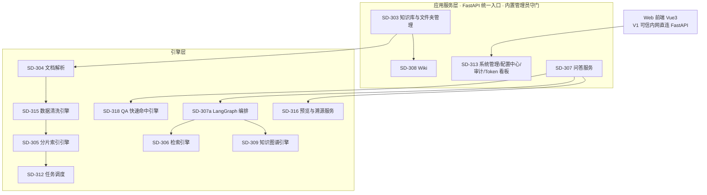
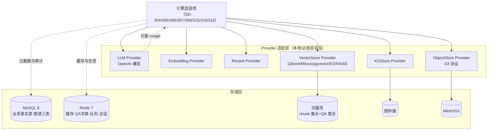
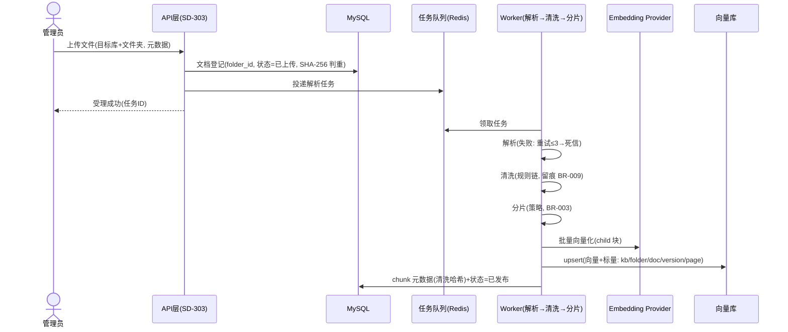
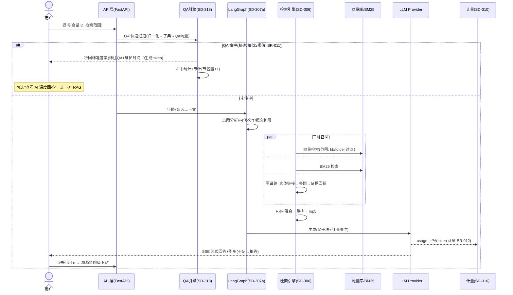
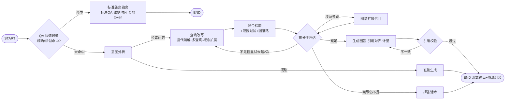
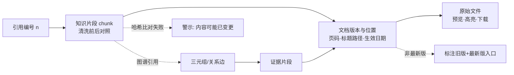
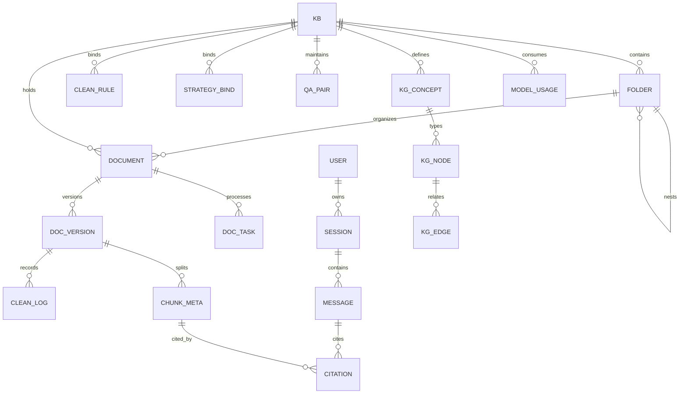

# WisdomLink2 企业级智能知识库平台 · 需求分析设计文档

| 文档头 | |
|---|---|
| 项目代号 / 名称 | wl2 / WisdomLink2 企业级智能知识库平台 |
| 文档名称 | 需求分析设计文档（需求分析 + 总体设计）——第一版（V1）范围 |
| 文档 ID | WL2-DOC-002 |
| 版本 | v1.2（语义化版本；确定性版本号 1.26.911.2350） |
| 日期 | 2026-09-11 |
| 作者 | HUAWEI（取自当前用户标识） |
| 状态 | **草稿**（选型决策为"建议+待确认门"；上游 WL2-DOC-001 v1.2 亦为草稿） |
| 生成方式 | 正向生成（来源：WL2-DOC-001 v1.2【来源未基线】 + WL2-DOC-003 v1.0 + 2026-09-11 联网调研） |

## 修订记录

| 版本 | 日期 | 作者 | 变更说明 |
|---|---|---|---|
| v1.0 | 2026-09-11 | HUAWEI | 初稿 |
| v1.1 | 2026-09-11 | HUAWEI | 范围重定义同步：清洗引擎/溯源服务/图谱三层/权限迁 V2 |
| v1.2 | 2026-09-11 | HUAWEI | **组织模型与新增功能同步**（用户第二轮意见）：① 组织模型定为 知识库→文件夹（多级）→文档，权限单元=知识库（SD-303 扩展文件夹树，数据模型增 folder 表）；② 新增 SD-318 QA 快速命中引擎（FR-131/BR-011/NFR-207，问答链路前置 QA 通道，图 5-2/5-3 更新，§8.10 策略）；③ SD-310 扩展 Token 计量与统计（FR-132/BR-012，数据模型增 model_usage 表，§12 看板）；④ 语义缓存优先级调整为 QA>语义缓存>RAG |

## 目录

- 第 0 章 引言
- 1 设计概述
- 2 需求分析
- 3 架构选型与取舍
- 4 模块划分
- 5 关键时序与流程
- 6 数据模型与存储
- 7 技术选型对比与决策建议
- 8 检索策略设计
- 9 分片策略设计
- 10 双模式（本地/远程）适配设计
- 11 安全设计（V1 基线）
- 12 可运营性设计
- 13 部署视图
- 14 评审记录（草案自评）
- 附录 A 来源与映射
- 附录 B 待确认清单

---

# 第 0 章 引言

## 0.1 一页摘要（业务语言）

本文档回答两个问题：**WisdomLink2 第一版的需求本质是什么**（第 2 章：14 个 V1 业务场景 → 41 条 V1 功能需求，归纳为 7 条核心链路和 9 个技术难点），以及**系统总体怎么建**（第 3–13 章）。

总体方案一句话：**模块化单体 + Provider 适配层**。平台按"应用—引擎—适配—存储"四层划分 15 个 V1 模块；所有会更换的依赖（大模型、向量化、重排、向量库、图存储、对象存储、解析与预览转换）都藏在统一"Provider 适配层"后面，管理员后台改配置即可在**本地部署**与**远程 API**之间、在不同**向量库厂商**之间切换，业务代码一行不动。

组织模型（用户第二轮意见确定）：**知识库是唯一权限与运营单元**（可建多个），库内用**多级文件夹**分类组织文档——文件夹只管分类不管权限，V2 权限以库为维度整体授予。V1 的五个关键设计：① 入库链路带清洗段（去噪留痕不改语义可还原）；② 问答前置 **QA 快速通道**——高频问题命中人工维护的 QA 问答对，毫秒级返回统一标准答案（不耗 LLM token），未命中才走 ③ **混合检索（语义+关键词+图谱多跳）+ 重排 + LangGraph 自纠错**；④ **多级溯源链**：引用→片段（清洗对照）→版本位置→原始文件，逐级可验证、哈希防篡改；⑤ **Token 用量统计**贯穿所有模型调用（按模型/库/用途/日计量+费用估算），远程账单不再黑箱。认证/权限/网关/开放 API 属 V2（WL2-DOC-003），V1 预留扩展点"只启用、不重构"。

## 0.2 目的与范围

承接 WL2-DOC-001 v1.2 的 V1 需求规格，给出需求分析与总体设计。**不含**：模块内部详细设计（C-01/C-02）、接口契约（B-04）、建表 DDL（B-10）、前端设计（WL2-DOC-004）、V2 功能设计（WL2-DOC-003）。

## 0.3 读者与阅读指南

| 角色 | 关注点 | 建议阅读 |
|---|---|---|
| 业务/产品/管理 | 方案思路、V1/V2 边界 | §0.1、§1、§3.1、§7.1 |
| 开发 | 模块边界、数据模型、策略要点 | §2.3、§4–§10 |
| 测试 | 规则落点、可测性 | §2.2、§8、§9、§14 |
| 运维 | 部署、降级矩阵、监控 | §10.3、§12、§13 |
| 安全 | V1 边界、密钥、注入防护 | §11 |
| 决策人 | 待确认选型 | §7.7、附录 B |

## 0.4 术语补充（业务术语见 WL2-DOC-001 v1.2 §0.5）

| 术语 | 解释 |
|---|---|
| Provider 适配层 | 屏蔽厂商差异的统一接口层，实现由配置选择（本设计核心机制） |
| QA 快速通道 | 问答链路最前置的通道：问题归一化→QA 精确/相似命中→直接返回标准答案（不调用生成模型） |
| 归一化 | 问题文本的确定性预处理：小写化、全半角统一、空白合并、首尾标点去除（BR-011 口径） |
| HNSW | 主流向量索引算法，高召回低延迟 |
| 稠密/稀疏向量检索 | 语义向量 / 词项权重向量（BM25 同族）检索 |
| 父子分片 | 小块命中、大块供生成上下文 |
| Cross-Encoder 重排 | 问题+片段成对联合打分的精排 |
| 实体链接 / 多跳检索 | 问题中识别图谱实体并消歧 / 沿关系逐跳扩展 |
| 概念/本体 | 知识分类体系：is-a 层级+同义词，实体是其实例 |
| 溯源链 | 引用→chunk→文档版本→原始文件的逐级可验证链路 |
| Token 计量 | 以模型 usage 为准的输入/输出 token 记账（BR-012 口径） |
| 检查点（Checkpoint） | LangGraph 流程状态持久化 |
| 死信队列 | 多次重试失败任务的隔离区 |
| RPO / RTO | 容灾指标 |
| Collection / Partition | 向量库数据划分单元（类比表/分区） |

## 0.5 参考资料

需求输入：WL2-DOC-001 v1.2（草稿）、WL2-DOC-003 v1.0、WL2-DOC-004（前端）。调研来源：WL2-DOC-001 v1.0 附录 A（引用标 §RR-n）。

---

# 1 设计概述

**解决什么**：企业知识"存得进（库/文件夹组织）、洗得净、找得快（QA 秒回+混合检索）、答得准且可信可溯源、花得明（Token 计量）、管得住、换得了"。

**总体思路**：
1. **一条入库链路、一条问答链路**作为主脊（图 5-1/5-2）：入库=解析→清洗→分片→向量化；问答=**QA 快速通道**→（未命中）→理解→混合检索→重排→生成→溯源链组装。
2. **Provider 适配层**兑现双模式+可插拔（§10）：7 类外部依赖接口化、配置化、可探测、可降级。
3. **策略配置化**：检索（§8）、分片（§9）、清洗规则、**QA 命中阈值**（BR-011）皆为知识库级配置，配套评测工作台形成闭环。
4. **真实性由机制保证**：清洗留痕（BR-009）+ 片段哈希比对（BR-010）+ 四级溯源（FR-118）；QA 标准答案显式标注并显示维护时间（R12 防陈旧）。
5. **成本可见**：所有模型调用经 SD-310 统一计量（BR-012），QA 命中计为"节省量"（语义缓存命中同口径）。
6. **V2 平滑演进**：认证/权限（以库为维度）/网关不进 V1 代码路径，扩展点全部预留。

**关键取舍**：模块化单体；向量库默认 Qdrant、大规模 Milvus；图存储 MySQL 三表+NetworkX；Celery+Redis；预览 LibreOffice+缓存。均为"建议+待门"。

---

# 2 需求分析

> 输入：WL2-DOC-001 v1.2 §3/§4/§5【来源未基线】；V2 边界 WL2-DOC-003。

## 2.1 场景 → 需求 → 链路映射

| 核心链路 | 覆盖场景 | 覆盖需求（主要） | 分析要点 |
|---|---|---|---|
| L1 知识入库（含清洗与组织） | SC-002/003/010/013 | FR-102/103/104/105/113/126/115/116/142 | **库/文件夹组织**；异步流水线；清洗质量决定索引上限；幂等与失败隔离 |
| L2 检索 | SC-001/004 | FR-106/117/122/123 | 混合召回+融合+重排；图谱关联第三路；500ms 预算 |
| L3 问答（QA 快速通道 + RAG + 溯源） | SC-001/004/012/**014** | FR-107/114/**131**/118/127/146 | **QA 前置**（毫秒级、零生成 token）；多轮流式引用拒答；四级溯源 |
| L4 Wiki 协作 | SC-003 | FR-120 | 发布→转 MD 文档复用 L1（含清洗） |
| L5 知识图谱 | SC-007 | FR-121/140 | 三层模型；抽取成本控制；与 L2 融合 |
| L6 平台治理与成本 | SC-005/006/008/011/**015** | FR-109/110/111/112/128/129/**132** | 配置中心/审计/降级/备份；**Token 计量与费用看板**；认证→V2 |
| L7 原件预览与溯源服务 | SC-001/012/013 | FR-118/127 | 转换缓存、定位高亮、哈希校验、清洗对照 |

## 2.2 核心业务流程分析（业务视角）

1. **入库**（SC-002/013）：在目标知识库（可指定文件夹）上传 → 解析为结构化文本 → 清洗（留痕可还原）→ 按策略分片 → 向量化 → 写向量库+元数据 →"已发布"可检索；失败可重试可见原因。
2. **问答**（SC-001/014）：提问 → **QA 快速通道**：归一化精确匹配 → 命中即秒回标准答案（标注 QA+维护时间，可一键"AI 深度回答"）；未精确命中 → QA 向量相似 ≥0.92 命中返回；仍未命中 → 理解问题（指代消解）→ 选定范围三路混合检索 → 精排 → 流式生成带引用 → 无依据拒答 → 引用四级下钻验证。
3. **QA 沉淀**（SC-014 运营闭环）：问答日志中高频问题 → 一键转为 QA 对草稿 → 管理员审核标准答案 → 启用 → 下次同类提问秒回。
4. **图谱问答**（SC-007）：实体链接命中 → 多跳扩展子图 → 概念扩展改写 → 证据片段回捞 → 融合排序 → 答案附关系证据可下钻。
5. **组件切换**（SC-005）与 **故障降级**（SC-008）：同 v1.1（§5.5/§10.3）。
6. **成本运营**（SC-015）：模型调用自动计量 → 看板按模型/库/用途/日聚合 → 异常日耗告警 → 调整策略（如提高 QA 覆盖/缓存阈值/切本地模型）。

## 2.3 关键技术难点与对策

| # | 难点 | 对策 |
|---|---|---|
| D1 | 多格式解析质量参差 | 解析器路由+降级+人工预览校对+重试隔离（SD-304） |
| D2 | 检索质量三目标（专有词精确+口语语义+多跳关系） | 混合检索+RRF+重排+图谱路（§8/§8.9），评测闭环（FR-124） |
| D3 | 权限过滤与性能矛盾 | **迁 V2**；V1 以"库/文件夹范围选择"替代，filter 已参数化 |
| D4 | 双模式切换状态一致性 | 维度一致性规则+切换预检+重建任务（§10.4/10.5） |
| D5 | 图谱构建成本/噪声 | Schema 约束+三层模型+别名归一+候选确认（§8.9、SD-309） |
| D6 | 删除级联一致性 | MySQL 事实源+异步补偿清理+残留校验（NFR-262） |
| D7 | 清洗质量与语义保持 | 白名单动作+diff 留痕+还原重建+低分转人工（BR-009、SD-315） |
| D8 | 溯源链一致性与原件预览 | 哈希实时比对+版本原子切换+预览缓存降级（BR-010、SD-316） |
| D9 | **QA 命中的准确性与陈旧性**【v1.2 新增】 | 精确优先+阈值与分差双控（BR-011）防误命中；停用即时退出（NFR-264）；维护时间展示+90 天待复核标记+命中统计驱动下线（R12）；从问答日志沉淀冷启动 |

## 2.4 性能预算分解

| 路径 | 环节与预算 |
|---|---|
| **QA 精确命中**（NFR-207） | 归一化 5ms + Redis 字典查询 10ms + 组装返回 10ms ≈ **P95 ≤ 50ms** |
| **QA 相似命中**（NFR-207） | 归一化 5ms + QA 向量查询（独立 collection）80ms + 阈值判定 5ms + 组装 20ms ≈ **P95 ≤ 200ms** |
| RAG 检索（NFR-201） | 范围解析 10ms + 查询理解 80ms + 双路召回 200ms + RRF 融合 20ms + 重排 150ms（可关）+ 富化 40ms = **500ms** |
| 生成 | 首 token 远程 P90 ≤2s / 本地 ≤5s（NFR-202）；语义缓存命中 <50ms |

---

# 3 架构选型与取舍

## 3.1 候选与对比

| 维度 | A. 模块化单体（分层） | B. 微服务 | C. 开源二开（Dify/RAGFlow） |
|---|---|---|---|
| 交付速度 | 快 | 慢 | 中 |
| 需求匹配 | 全部自选需求可落地（多向量库可插拔、双模式、清洗配置化、QA 直答、图谱三层、溯源链、Token 计量） | 同 A | 硬需求需魔改：RAGFlow 向量库绑定内置栈；QA/溯源/计量深度定制受限 |
| 运维成本 | 低 | 高 | 中 |
| 技术债风险 | 边界不清则腐化→模块边界约束 | 过早拆分浪费 | 受上游牵制 |

**取舍：模块化单体**。适用边界与演进同 v1.1（解析/清洗 Worker 与问答服务可先拆；V2 入口前置网关）。**不为先进而先进**。

## 3.2 总体风格

- 分层：应用服务层 → 引擎层 → 适配层 → 存储层，依赖单向（V1 无独立接入层，FastAPI 统一入口+内置管理员守门）。
- 读写模型：管理/写入 MySQL 强一致；检索路径组合最终一致（删除级联 NFR-262）。
- 异步化：解析/清洗/向量化/图谱抽取/**QA 向量化**/预览转换全部异步任务。

---

# 4 模块划分

## 4.1 总体架构图



图 4-1 V1 应用架构（13 节点；来源：WL2-DOC-001 v1.2 FR 全集 + §3.1 决策建议；SD-301/302/314 见 WL2-DOC-003）



图 4-2 适配层与存储视图（来源：FR-109/110/131/132、NFR-233）

## 4.2 模块清单

| SD-ID | 模块 | 职责 | 来源 | 关键设计点 |
|---|---|---|---|---|
| SD-301 | API 网关 | **【V2】** | FR-119 | V1 由 FastAPI 统一入口替代 |
| SD-302 | 认证与权限 | **【V2】**（权限以库为维度） | FR-101/108 | V1 内置管理员+检索范围参数化 |
| SD-303 | 知识库与文件夹管理 | **知识库（唯一权限与运营单元）** CRUD/归档；**库内多级文件夹树**（≤5 级可配，移动/合并）；文档归类与批量移动；检索范围可细化到文件夹；策略三件套+QA 绑定 | FR-102/104/126 | folder 物化路径（path 前缀）支撑范围过滤；文件夹不参与权限（V2 库级授权） |
| SD-304 | 文档解析 | 多格式解析器路由、结构化输出 | FR-103、D1 | 双模式引擎；失败分类错误码 |
| SD-305 | 分片与索引引擎 | 清洗后文本 chunking、向量化、向量写入、幂等重建 | FR-105/110 | **QA 向量化复用本引擎**（写入 QA 集合） |
| SD-306 | 检索引擎 | 三路召回（向量+BM25+图谱）、RRF、重排、父子富化、语义缓存 | FR-106/117/123/146 | 预算控制；降级开关 |
| SD-307 | 问答服务 | 会话、prompt、流式生成、引用对齐拒答 | FR-107/114 | 引用槽位映射；**先问 SD-318** |
| SD-307a | LangGraph 编排 | 问答状态机（图 5-3）、自纠错、checkpoint | FR-107 | QA 通道为图入口第一个分支 |
| SD-308 | Wiki 模块 | 页面树/MD 编辑/版本/评论；发布复用 L1 | FR-120 | source_type=wiki |
| SD-309 | 知识图谱引擎 | 概念/实体/关系三层、Schema 约束抽取、候选确认、子图查询、导入导出 | FR-121/117/140 | 三表+NetworkX；evidence 回链 |
| SD-310 | 模型服务与计量 | Provider 注册路由；**全调用 Token 计量**（usage 优先/估算兜底）、用量落库、单价与费用估算、用量明细查询接口 | FR-109/123/**132** | 所有 LLM/Embedding 调用必经计量中间层（BR-012）；预算控制点 |
| SD-311 | 向量库适配 | VectorStoreProvider、集合管理（chunk 集合+QA 集合）、迁移工具 | FR-110 | 能力探测 |
| SD-312 | 任务调度 | Celery 队列、重试/死信、进度 | FR-113 | 指数退避 ≤3 |
| SD-313 | 系统管理 | 配置中心、健康检查、指标、审计查询、**Token 看板后端**、任务/死信/清洗低分队列处置 | FR-111/112/128/**132** | 配置版本化热更新 |
| SD-314 | 开放 API | **【V2】** | FR-125 | — |
| SD-315 | 数据清洗引擎 | 规则清洗、留痕 diff、还原重建、质量评分 | FR-115/116、BR-009 | 位置上下文判定；规则链有序 |
| SD-316 | 预览与溯源服务 | 四级溯源链、原件预览/高亮/下载、哈希校验 | FR-118/127、BR-010 | 转换缓存；失败降级下载 |
| SD-318 | QA 快速命中引擎【v1.2 新增】 | QA 对 CRUD/导入导出/启停；**命中判定**（归一化精确 → 向量相似双阈值）；命中字典缓存维护；命中统计与审计；问答日志一键沉淀 QA 草稿；复审到期标记 | FR-131、BR-011、NFR-207/264、R12 | 字典缓存 Redis（qa_dict）+QA 向量集合；变更 ≤1 分钟生效；未命中透传 RAG |

依赖方向：L2→L3→L4→L5 单向；L2 间仅经领域事件（Redis Stream）协作。

---

# 5 关键时序与流程

## 5.1 文档入库时序（L1，含清洗与文件夹归类）



图 5-1 入库时序（来源：FR-102/103/105/113/115/126；BR-002/003/008/009）

## 5.2 问答时序（L3：QA 快速通道 → RAG → 溯源）



图 5-2 问答时序（来源：FR-107/117/118/**131**/**132**；BR-004/007/010/011/012）

## 5.3 问答状态机（LangGraph，含 QA 入口分支）



图 5-3 问答状态机（来源：FR-107/131；BR-004/011）

## 5.4 多级溯源链（SD-316）



图 5-4 多级溯源链（来源：FR-118；BR-010）

## 5.5 组件切换流程

同 v1.1（预检→确认→版本化发布→热更新广播→冒烟→审计，≤5 分钟）。

## 5.6 QA 沉淀闭环（SD-318 × SD-313）【v1.2 新增】

问答日志聚合（高频/未命中/点踩问题榜单）→ 管理员一键"转为 QA 对"（预填问题与最佳历史回答）→ 编辑标准答案（可附引用文档）→ 启用 → 字典与 QA 向量 ≤1 分钟生效（NFR-264）→ 命中统计回流验证效果（FR-124 评测含 QA 命中准确率）。

---

# 6 数据模型与存储

## 6.1 存储职责划分

| 存储 | 职责 | 读写模式 |
|---|---|---|
| MySQL 8 | 事实源：知识库/**文件夹**/文档/清洗/QA 对/分片元数据/会话/审计/配置/**图谱三表/model_usage** | 强一致写 |
| Redis 7 | 范围缓存、会话、语义缓存、**QA 归一化字典**、任务队列、配置广播 | 高频读写可重建 |
| 向量库 | **chunk 集合**（检索）+ **QA 集合**（命中判定） | 批量写、高频查询 |
| 图存储 | 默认 MySQL 三表+NetworkX | 批量写、子图查询 |
| MinIO/S3 | 原件、清洗快照、预览缓存 | 写一次读多次 |

## 6.2 MySQL ER（概要）



图 6-1 ER 概要图（19 实体；来源：FR-102/104/105/107/112/115/117/118/**121/131/132**；字段级设计归 B-10）

核心表要点（B-10 展开）：
- `kb(id, tenant_id, name, status, strategy_bind_id, is_local_only…)`：唯一权限单元；tenant_id 为 V2 预留。
- `folder(id, kb_id, parent_id, name, path, depth, sort…)`：**物化路径** `path`（如 `/A/B/`）支撑"文件夹范围检索"前缀过滤；depth ≤5（B-30）；同层同名允许但提示。
- `document(id, kb_id, folder_id, title, source_type, sha256, current_version, status, effective_date…)`：状态机 BR-008。
- `qa_pair(id, kb_id, folder_id, std_question, std_answer_md, variants_json, ref_doc_ids, enabled, weight, hit_count, last_hit_at, review_due_at, status, updated_at…)`：QA 对全量字段（BR-011/R12）；变体与标准问同入命中字典与 QA 向量集合。
- `model_usage(id, stat_date, model_id, provider, kb_id, purpose[chat|rewrite|extract|embed|qa_embed], prompt_tokens, completion_tokens, call_count, error_count, is_estimated, cost_est…)`：按日聚合（BR-012 口径）；明细在 message.token_in/out 与 usage 明细表。
- `chunk_meta(id, doc_version_id, parent_chunk_id, seq, token_len, page, heading_path, clean_hash, vector_ref…)`。
- `message(question, answer, answer_type[rag|qa|cached], citations_json, latency_ms, token_in/out, tokens_saved, model_id, degraded_flag…)`：`answer_type` 区分 QA/缓存/RAG；`tokens_saved` 记节省量。
- `clean_rule` / `clean_log` / `citation` / `kg_concept` / `kg_node` / `kg_edge` / `sys_config` / `audit_log`：同 v1.1（审计事件增 QA 对变更与命中、用量导出）。

## 6.3 向量库集合 Schema（统一抽象）

| 集合 | 字段要点 | 用途 |
|---|---|---|
| chunk 集合（每库 1 个） | chunk_id / vector(dim) / sparse 可选 / text / kb_id / folder_id / doc_id / doc_version / acl_level(V2 预留) / source_type / page / heading_path | 检索（范围过滤含 folder_id 前缀） |
| **QA 集合（每库 1 个，qa_{kb_id}）**【v1.2 新增】 | qa_id / vector(标准问+变体各自向量化) / normalized_q / enabled / weight / folder_id | QA 相似命中（与 chunk 集合物理隔离，避免混检误回） |

不支持标量过滤的实现（FAISS）仅限开发模式（能力探测声明）。

## 6.4 Redis Key 设计（概要）

| Key 模式 | 用途 | TTL |
|---|---|---|
| `scope:{session_id}` | 会话检索范围（kb/folder 集合） | 7d |
| `session:{sid}` / `msg:{sid}` | 会话与多轮上下文 | 7d |
| `qa_dict:{kb_id}` | **QA 归一化问题→qa_id 字典**（精确命中主数据） | 永久+变更失效（NFR-264） |
| `semcache:{kb_set_hash}:{qvec_bucket}` | 语义缓存（优先级低于 QA，BR-011） | 24h 可配 |
| `cfg:version` | 配置版本广播 | 永久 |
| Celery broker / Redis Stream | 任务与领域事件 | 按策略 |

---

# 7 技术选型对比与决策建议

> 全部结论为"建议+待门"。证据来源与 POC 要求同 v1.1。

## 7.0 选型总纲

每类候选必须同时具备本地部署与远程服务两种形态，且经 Provider 接口接入（一票否决）。新增：**QA 引擎与 Token 计量为内置实现**（无外部依赖），但其依赖的字典/向量/LLM 计量走既有 Provider。

## 7.1 总体架构与基础框架

| 决策点 | 建议 | 理由 |
|---|---|---|
| 架构风格 | **模块化单体** | §3.1 |
| Web 框架 | **FastAPI** | 异步 SSE、自动 OpenAPI 文档、Pydantic |
| 异步任务 | **Celery 5 + Redis** | 成熟生态；Windows 用 solo pool/WSL2 |
| 前端 | **Vue3 + TS + Element Plus + Pinia**（详见 WL2-DOC-004） | 企业后台生态 |
| 文档预览转换 | **LibreOffice headless + 缓存**（ADR-011） | PDF 直预览+Office 转换缓存 |
| 图表（Token 看板） | **ECharts 5**（B-9 联动） | 趋势/排行/下钻 |

## 7.2 向量库（FR-110）

同 v1.1 对比矩阵（Qdrant 默认 / Milvus 大规模 / pgvector 轻量 / ES 复用栈 / Weaviate 备选 / FAISS 开发 / Chroma 原型）。**补充**：QA 集合与 chunk 集合使用同一 VectorStoreProvider 体系，适配一次两类集合同时可用；评测验收含 QA 命中准确率。

## 7.3 LLM / Embedding / Rerank 接入（FR-109/132）

| 决策点 | 建议 | 理由 |
|---|---|---|
| LLM 协议 | **统一 OpenAI 兼容 Provider**（base_url+api_key+model 配置化） | 本地/远程全兼容 |
| LLM 模型矩阵 | 管理面"模型矩阵表"（用途×provider×model×限速×**单价**） | 单价同时服务 FR-132 费用估算（BR-012） |
| Embedding | **默认 BGE-M3**（本地进程内/Xinference；远程兼容 API） | 中文优、稠密+稀疏双出 |
| Rerank | BGE-reranker（本地）/Cohere·Jina（远程）双实现 | 按库权衡 |
| **计量** | **所有调用经 SD-310 计量中间层**：usage 原值优先，tokenizer 估算兜底并标注 | BR-012 唯一口径，杜绝旁路漏计 |

## 7.4 编排框架

**LangChain（版本锁定）+ LangGraph**（图 5-3 的 QA 分支/自纠错/checkpoint 均为其强项）。LlamaIndex 延后登记（触发条件同 v1.1）。

## 7.5 知识图谱存储

同 v1.1：默认 **MySQL 三表 + NetworkX**；概念层（is-a+同义词）数据量小由 MySQL 直查；多跳扩展由内存图承担。Neo4j/Nebula 延后（边 >500 万或多跳 ≥3 常规化且 P95 >1s 触发重议）。

## 7.6 对象存储 / 消息 / 可观测

同 v1.1（MinIO/S3 协议；Redis Stream 起步、Kafka 延后；Prometheus+Grafana+OTel，**Token 指标为一级看板**）。

## 7.7 决策汇总（ADR 建议稿，全部"待门"）

| ADR | 决策 | 状态 |
|---|---|---|
| ADR-001 | 模块化单体；V2 入口前置网关 | 建议 |
| ADR-002 | FastAPI + Celery(Redis broker) | 建议 |
| ADR-003 | LangChain + LangGraph（版本锁定） | 建议 |
| ADR-004 | 向量库适配顺序 Qdrant→Milvus→pgvector→ES→FAISS(dev)；chunk/QA 双集合同适配 | 建议 |
| ADR-005 | LLM/Embedding/Rerank 统一 OpenAI 兼容 Provider | 建议 |
| ADR-006 | 图存储 MySQL 三表+NetworkX，Neo4j/Nebula 延后 | 建议 |
| ADR-007 | 对象存储 S3 协议（MinIO/云） | 建议 |
| ADR-008 | 前端 Vue3+Element Plus（详见 WL2-DOC-004） | 建议（B-9） |
| ADR-009 | MySQL 8 + Redis 7（用户指定） | 既定 |
| ADR-010 | 部署双形态 Compose/K8s | 建议 |
| ADR-011 | 预览：PDF.js + LibreOffice headless 转换缓存；远程转换 API 备选 | 建议（B-25） |
| ADR-012 | **QA 引擎内置实现：Redis 归一化字典（精确）+ QA 向量集合（相似，BGE-M3）；LangGraph 入口分支**【v1.2 新增】 | 建议（B-28） |
| ADR-013 | **Token 计量中间层：全调用必经、usage 优先/估算兜底、日聚合表+看板**【v1.2 新增】 | 建议（B-29） |

---

# 8 检索与命中策略设计（SD-306/307a/309/318，来源：FR-106/107/117/122/123/**131**/146，BR-004/007/010/**011**）

## 8.1 查询理解层（FR-122）

1. 意图分类：闲聊/检索问答/图谱问答（决定图 5-3 路由）。
2. 指代消解改写：携带最近 N 轮（Redis `msg:{sid}`）。
3. 多查询扩展（1→3 变体）与概念扩展（kg_concept 同义词/上下位并入改写）。
4. HyDE 默认关（延迟预算），评测后按库开启。

## 8.2 召回层（并行三路）

| 召回路 | 实现 | 默认 top_k |
|---|---|---|
| 稠密向量 | child 块 ANN（HNSW） | 20/路 |
| 稀疏关键词 | BM25（jieba，B-14）或 BGE-M3 sparse | 20/路 |
| 图谱关联 | 实体链接→多跳→证据回捞（§8.9） | 10 |

**检索范围（V1）**：过滤条件 `kb_id ∈ 选定集合`，可选细化 `folder_id 前缀 ∈ 选定文件夹`，且 `doc_version=current && status=published`，在向量库侧执行。（V2 替换为权限集合，引擎零改动。）

## 8.3 融合层

RRF（BR-007）：k=60；图谱路为独立一路；多查询变体各为一路；并列按 chunk_id 稳定排序；单路存活直接用该路排名。

## 8.4 重排层（FR-123）

Cross-Encoder Top50→Top5；失败/超时（>300ms）跳过并标 `degraded_flag`。

## 8.5 生成层（FR-107/BR-004）

父子块组装（child 命中取 parent）；引用槽位对齐与校验；拒答与冲突提示（生效日期排序+可下钻核实）。

## 8.6 Agentic 自纠错（LangGraph）

图 5-3：QA 分支在最前；充分性不足改写重检 ≤2；引用校验失败重生成 ≤1；全路径审计（含 QA 命中/节省 token）。

## 8.7 缓存与直答优先级（BR-011）

**QA（人工维护，最优先）→ 语义缓存（自动相似）→ RAG 生成**。QA 命中返回标准答案并计"节省量"；语义缓存命中标注"缓存命中"。两层缓存均受库 scope 约束防跨库串答。

## 8.8 评测闭环（FR-124）

评测集含两部分：**QA 部分**（标准问+变体+应拒答的近义干扰问 → 命中准确率 ≥95%、误命中率 ≤2%，§2.2）与**检索部分**（Recall@k/MRR）；配置 A/B 对比留档作为发布门禁（宪法红线 2）。

## 8.9 图谱关联检索（FR-117）

同 v1.1：实体链接（别名词典+上下文向量消歧）→ 多跳扩展（默认 1 跳 ≤2，节点上限 500，B-24）→ 概念扩展 → 证据回捞（evidence_chunk_id → chunk 独立一路入 RRF）→ 相关实体/文档推荐；图谱路预算独立（命中时 +150ms 上限）。

## 8.10 QA 快速命中策略（FR-131，SD-318）【v1.2 新增】

1. **两级判定**：① 归一化精确匹配（BR-011 口径：小写/全半角/空白/首尾标点）→ Redis `qa_dict:{kb_id}` 字典（标准问+全部变体），O(1) 命中；② 未精确命中 → 问题向量化后在 **QA 集合**（与 chunk 集合隔离）ANN 查询，取范围内最高分：≥0.92 且与次高 ≥0.02 分差才命中（双阈值防边界抖动与误命中，B-28 可配）。
2. **范围与多库**：仅在会话选定的库范围内判定；多库多命中→分数最高→权重→库序（BR-011）。
3. **返回形态**：标准答案（Markdown 渲染）+ "标准答案（QA）"徽标 + 所属库与维护时间 + 关联引用文档（ref_doc_ids，可下钻原件）+ "查看 AI 深度回答"次级按钮（显式触发 RAG，不自动）。
4. **即时生效**：QA 对增删改/启停 → 双写字典与 QA 向量 → 失效广播 ≤1 分钟（NFR-264）；Redis 故障降级直查 MySQL+向量库（NFR-222）。
5. **运营闭环**：命中统计（hit_count/last_hit_at）、问答日志高频问题一键转 QA（§5.6）、90 天未复审标记"待复核"（R12，B-31）、低命中 QA 下线建议。
6. **成本收益**：QA 命中 0 生成 token（仅一次 QA 向量查询或字典查询），统计进"节省量"——是 FR-132 看板中"优化效果"的直接证据（SC-015 闭环）。

---

# 9 分片策略设计（SD-305，来源：FR-105/126/131，BR-003）

> 含两层：文档分片（chunking）与向量库数据分片（sharding）。输入恒为清洗后文本（NFR-263）。

## 9.1 文档分片策略引擎

| 策略 | 机制 | 适用 | 默认参数 |
|---|---|---|---|
| 递归字符分片（基线） | 分隔符层级递归 | 纯文本兜底 | 512 token，重叠 64 |
| **父子分片（主力）** | child 入库、parent 供生成 | 说明文/制度/手册 | child 512 / parent 2048 |
| Markdown 标题感知 | 按标题边界，heading_path 入标量 | MD/Wiki | 层级到 H3 |
| 表格原子化 | 整表一片，超长按行组切+复制表头 | Excel/含表 PDF/Word | 行组 ≤30 |
| 语义分片 | 嵌入相似度断点 | 质量敏感库 | 阈值百分位 75% |
| 固定长度 | 严格定长 | 实验基线 | 仅显式选择 |
| Late chunking | 先嵌入后切 | 延后 | — |

策略路由（文件类型+解析结构→模板）、±20% 容差、幂等 `(doc_version_id, seq, hash)`、重建复用流水线——同 v1.1。**QA 文本不参与文档分片**（标准问/变体按条目直接向量化入 QA 集合）。

## 9.2 向量库数据分片

Collection 划分：**每库两类集合**——`chunk_{kb_id}` 与 `qa_{kb_id}`（1:1，理由同 v1.1：范围过滤基数小、故障隔离、按库参数独立）；规模策略与扩容迁移流程同 v1.1（≤100 万 Qdrant 单机 / 100–1000 万小集群 / >1000 万 Milvus 集群 + partition 拆分触发条件）。

## 9.3 分片与检索联动

检索路由：`kb_id → collection 定位（chunk/qa 两类）`→ 范围过滤（可含 folder 前缀）→ 召回；QA 通道路由：`kb_id → qa_dict + qa_{kb_id}`。跨库检索/命中 = 多集合并行后融合（BR-007 / BR-011 tie-break）。

---

# 10 双模式（本地/远程）适配设计（FR-109/110/123，NFR-233/244）

## 10.1 Provider 统一接口

```
LLMProvider:         chat(...) -> str | AsyncStream ; usage() -> Usage ; health()
EmbeddingProvider:   embed(texts) -> vectors ; dim ; health()
RerankProvider:      rerank(query, docs, top_n) ; health()
VectorStoreProvider: upsert/delete_by_filter/search/capabilities()/migrate()（chunk 与 QA 集合同接口）
KGStoreProvider:     upsert_graph/neighbors/expand_subgraph/health()
ObjectStoreProvider: put/get/presign（S3 协议）
ParseProvider:       parse(file) -> StructuredDoc
PreviewProvider:     to_pdf(file) -> pdf_ref
```

QA 引擎与 Token 计量为内置实现（无 Provider），但其向量查询/LLM 计量依赖上述 Provider。能力探测与降级路由同 v1.1。

## 10.2 配置模型

同 v1.1 结构，新增：`qa: {exact_dict: redis, similarity_threshold: 0.92, margin: 0.02, review_due_days: 90}`、`metering: {enabled: true, price_book: {model_id: {in: x, out: y, currency: CNY}}}`（密钥走 vault 引用）。

## 10.3 降级矩阵（NFR-222）

| 故障组件 | 自动动作 | 用户感知 |
|---|---|---|
| 远程 LLM | 切本地/提示 | 质量档位提示 |
| 双 LLM 失效 | 停用生成，保留检索列表与 **QA 通道（不受影响）** | "AI 回答暂不可用"（QA 仍秒回） |
| 向量库 | 退化 BM25 | "降级模式" |
| QA 向量集合故障 | 精确字典仍可用，相似命中关闭 | QA 精确命中不受影响 |
| Redis | QA 字典直查 MySQL；其余直连 | 变慢可用 |
| 图谱路 / Rerank / 预览转换 | 跳过该路/跳过精排/降级下载 | 轻微降级（审计） |

## 10.4 / 10.5 切换流程与维度一致性

同 v1.1（预检清单、≤5 分钟生效、换 Embedding 模型必触发 chunk 与 **QA 集合**双重建）。

---

# 11 安全设计（V1 基线）

同 v1.1 四节（内置管理员守门/边界假设 NFR-219；密钥 AES-GCM 与白名单；提示注入四层防护；审计只增）+ 补充：
- **QA 内容安全**：QA 对为人工维护内容，入库前过敏感词校验；QA 命中记录同样入审计（问题、命中 QA id）。
- **计量数据**：用量明细含问题维度时遵循审计脱敏口径（导出仅聚合数据+会话号）。

---

# 12 可运营性设计（FR-111/112/128/132）

## 12.1 管理面功能映射（V1）

知识库/文件夹参数、策略三件套、**QA 对管理**（列表/编辑/导入导出/复审队列/沉淀入口）、Provider 配置向导、**Token 用量看板**、系统参数、任务/死信/清洗低分队列、审计查询、评测工作台、备份恢复。

## 12.2 健康检查

同 v1.1（MySQL/Redis/向量库/图谱/Provider 级联探测；**QA 字典与 QA 集合探活**）。

## 12.3 指标与告警（Prometheus）

新增：**QA 命中率与命中延迟（精确/相似分计）**、**Token 日耗（按模型/库）与费用估算**、缓存与 QA 合计节省 token。告警示例：QA 误命中反馈（点踩标误）>5 次/日、日耗超阈值（FR-132/143）、其余同 v1.1。

## 12.4 配置热更新与回滚

同 v1.1；QA 阈值/单价变更亦走版本化热更新（不重启）。

---

# 13 部署视图

同 v1.1（Compose 最小部署 / K8s 生产 / 资源三档），差异：worker 队列增加 QA 向量化队列；监控面板增加 QA 与 Token 看板；V1 网络策略（内网/全员口令）不变。

---

# 14 评审记录（草案自评——显式视角切换）

**【视角切换声明】以首席开发专家视角（可实现性）审视**：在 v1.1 五项前置验证（Celery-Win/能力探测/版本锁定/清洗位置上下文/图内存）基础上新增——⑥ QA 双集合与字典的一致性维护（NFR-264 的 ≤1 分钟生效）依赖"双写+失效广播"，POC 需验证故障时的一致性补偿；⑦ Token 计量中间层必须做到"无旁路"（所有调用点收口到 SD-310），建议以中间件/装饰器形式强制而非约定。结论：可控，7 项前置验证已识别。

**【视角切换声明】以首席测试设计专家视角（可测试性）审视**：BR-011（5 个样例含双阈值边界与停用即时性）、BR-012（4 个样例含跨日与节省量）均可判定，oracle 齐备；QA 误命中对抗用例（近义干扰问）应进 B-06 决策表。结论：良好。

**【视角切换声明】以首席安全专家视角（预检）审视**：QA 人工内容入库的敏感词校验与命中审计已补；计量导出仅聚合+会话号，无问题明文外泄。结论：基线成立。

**【视角切换声明】以首席产品视角（业务价值）预检**：QA 秒回与 Token 看板直接回应"高频问题重复作答"与"费用黑箱"两大痛点（SC-014/015），与既有溯源/清洗形成完整价值闭环。结论：价值明确。

| 评审人角色 | 意见摘要 | 结论 | 日期 |
|---|---|---|---|
| 首席开发（预检） | 7 项前置验证 | 有条件通过 | 2026-09-11 |
| 首席测试（预检） | BR-011/012 oracle 齐备；QA 误命中对抗用例进 B-06 | 有条件通过 | 2026-09-11 |
| 首席安全（预检） | QA 内容校验与计量脱敏已补 | 有条件通过 | 2026-09-11 |
| 首席产品（预检） | SC-014/015 价值闭环成立 | 有条件通过 | 2026-09-11 |
| 业务/产品（确认门） | 待用户审阅 | 待定 | — |

---

# 附录 A 来源与映射

**A.1 需求 → 设计元素映射（主链）**

| FR/NFR | SD | 备注 |
|---|---|---|
| FR-102（库+文件夹） | SD-303 | 物化路径、范围过滤 |
| FR-103/104/126 | SD-304/303 | BR-002/006/008 |
| FR-115/116 | SD-315 | BR-009、D7 |
| FR-105/110 | SD-305/311 | §9；QA 集合同适配 |
| FR-106/117/123/146 | SD-306 | §8/§8.9 |
| FR-107/114 | SD-307/307a | 图 5-2/5-3 |
| **FR-131** | **SD-318** | §8.10、BR-011、ADR-012 |
| **FR-132** | **SD-310/313** | BR-012、ADR-013、§12.3 |
| FR-118/127 | SD-316 | 图 5-4、BR-010 |
| FR-120 | SD-308 | 复用 L1 |
| FR-121/140 | SD-309 | 三层模型 |
| FR-109 | SD-310 | §10 |
| FR-113 | SD-312 | BR-008 |
| FR-111/112/128 | SD-313 | §12 |
| FR-101/108/125/119/160 | SD-301/302/314/317 | 【V2】WL2-DOC-003 §4 |
| NFR-207 | SD-318 | §2.4 预算 |
| NFR-264 | SD-318 | 字典/向量双写+失效 |

**A.2 上游输入声明**：WL2-DOC-001 v1.2、WL2-DOC-003 v1.0 均为草稿；确认门后增量对齐（B-08 R1–R4）。

**A.3 调研引用**：WL2-DOC-001 v1.0 附录 A（§RR-1…5）。

# 附录 B 待确认清单

继承 WL2-DOC-001 v1.2 附录 B（B-2…B-15、B-22…B-25、**B-28…B-31**），设计新增：

| # | 待确认项 | 建议 | 影响 |
|---|---|---|---|
| B-16 | ADR-001…**013** 过门裁决 | 按建议稿 | C-01/C-02 硬约束 |
| B-17 | collection 划分（按库 1:1，chunk/qa 双集合） | 按库 1:1 | §9.2 |
| B-18 | BM25 中文实现 | 内置 jieba | §8.2 |
| B-19 | 异步任务 Windows 兼容 | WSL2 为主 | 开发环境 |
| B-20 | Embedding 默认 BGE-M3 | 确认 | 维度管理 |
| B-21 | LangChain/LangGraph 锁定版本 | C-02 前定版 | ADR-003 |
| B-26 | 清洗位置上下文 POC | B-05 首批 | D7 |
| B-27 | 图谱默认 Schema | C-02 前定 | FR-121 |
| B-32 | QA 字典与 QA 集合一致性 POC【v1.2 新增】 | B-05 首批（双写+失效广播+故障补偿） | NFR-264 |
| B-33 | Token 计量收口方式（装饰器强制）【v1.2 新增】 | C-02 详细设计定 | ADR-013 |
